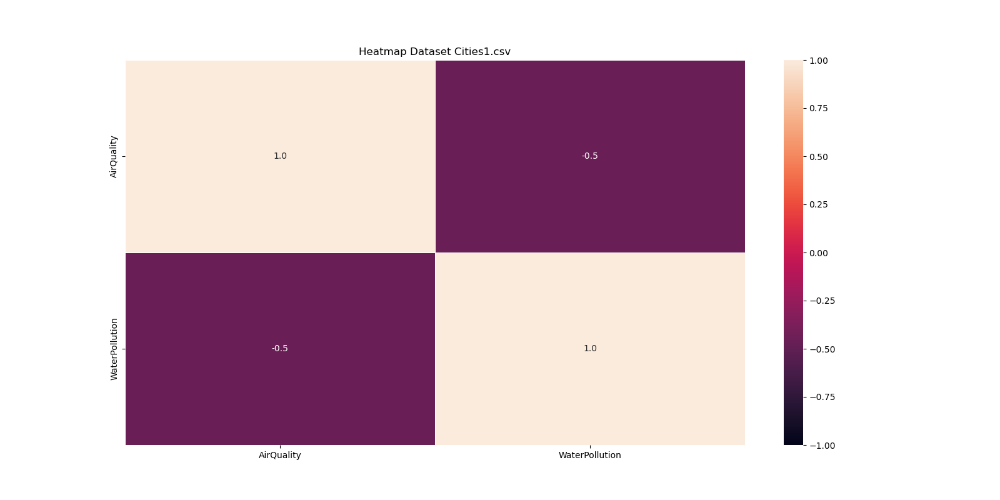
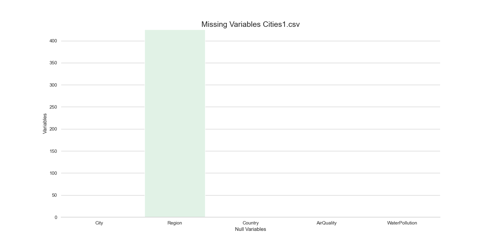
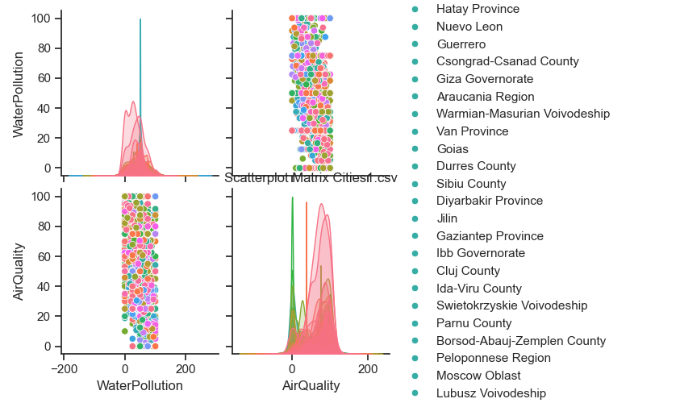

# Pandas Profiling Clone

This project aims to create a simplified clone of **Pandas Profiling**, developed entirely in **Python** and **Jupyter Notebook**, without relying on any external libraries.

## Features
- Analyze any **CSV file** and provide detailed insights.
- Key information extracted includes:
  - Missing data analysis.
  - Number of rows and columns.
  - Column names and data types.
  - Additional descriptive statistics.

## Why This Project?
The goal is to demonstrate the ability to recreate essential functionality from scratch, enhancing understanding of core programming concepts and data analysis techniques.

## How to Use
1. Clone this repository.
2. Open the Jupyter Notebook.
3. Load your CSV file into the notebook.
4. Run the analysis to get a detailed profile of your dataset.

## Future Enhancements
- Add visualizations for data distributions and correlations.
- Improve performance with optimized algorithms.

Feel free to contribute or provide feedback!

## Tech Stack

- Python
- Jupyter Notebook

## Images Project

 

 

 

